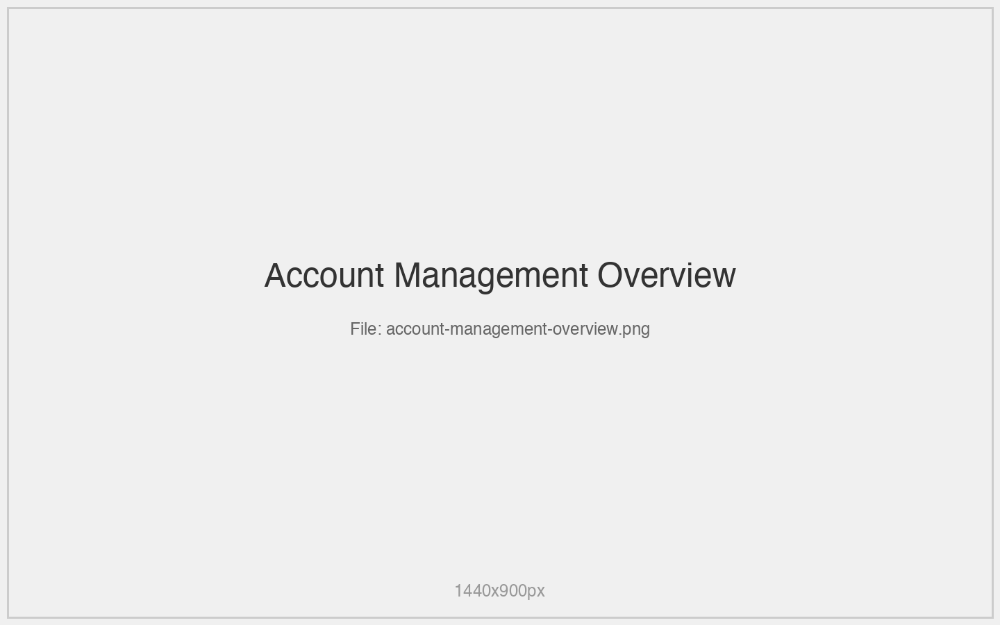
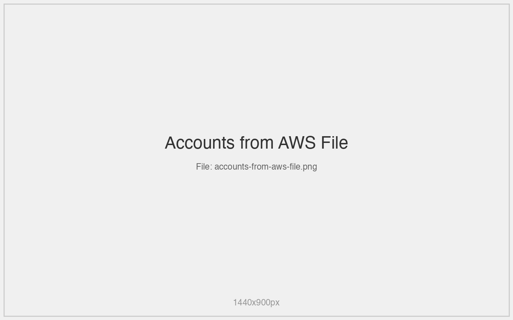
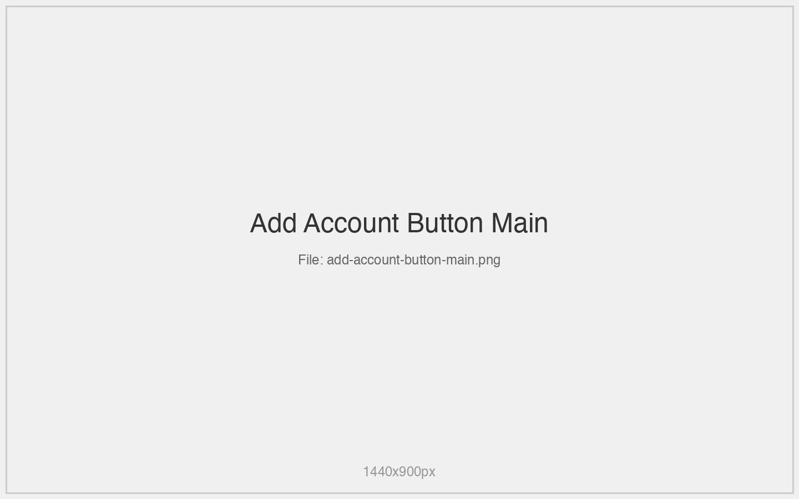
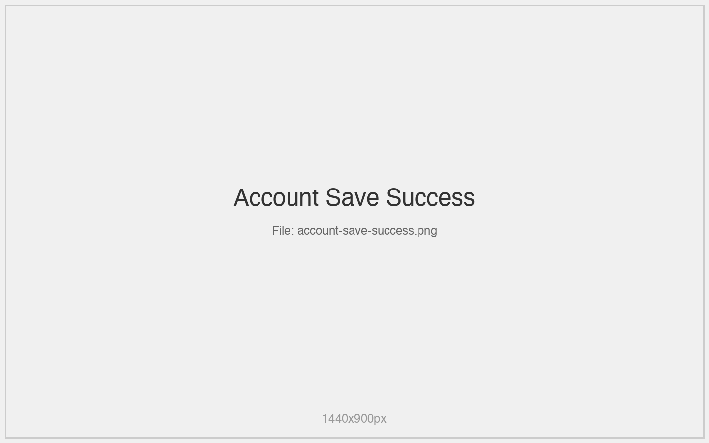
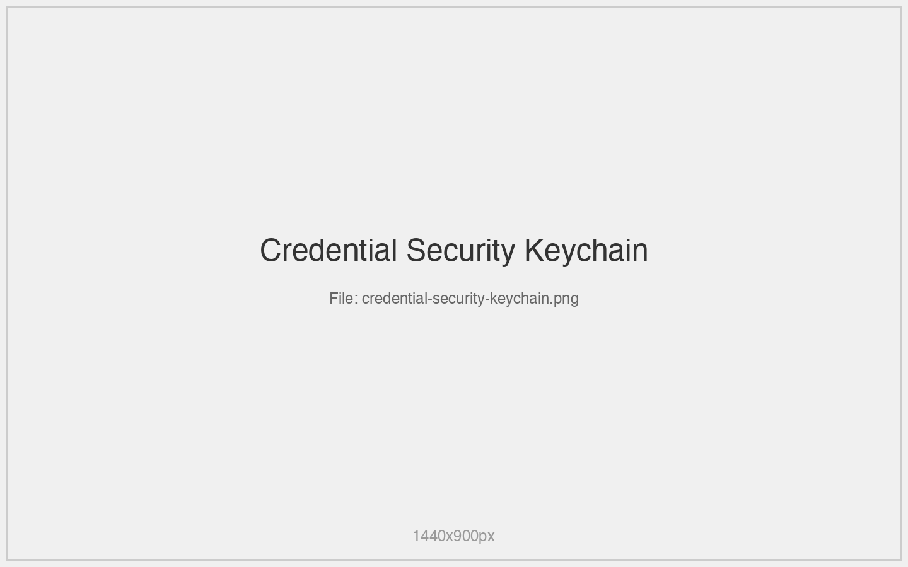
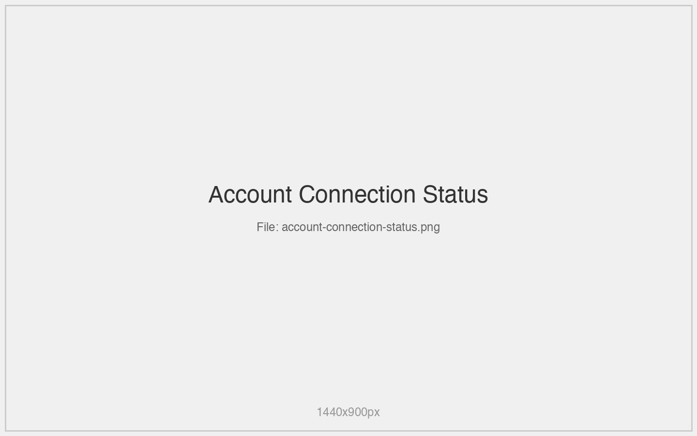
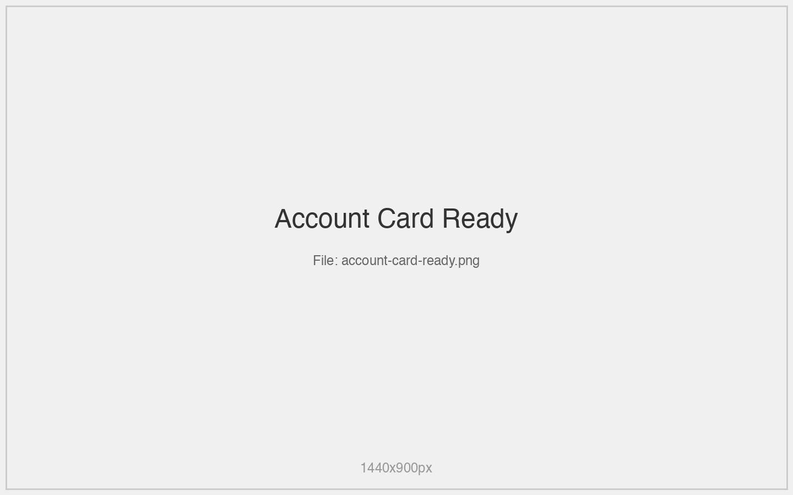
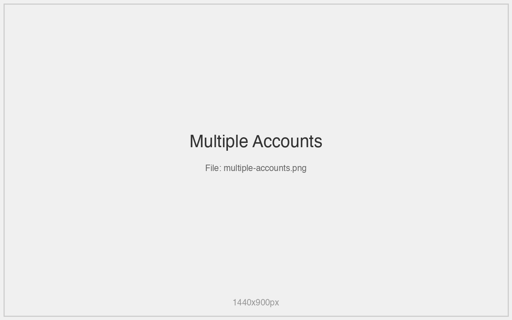

# Account Management

Comprehensive guide to managing AWS accounts in DinoDB.

## Overview

DinoDB supports two types of account storage:
- **AWS Profiles**: Read from `~/.aws/credentials` (read-only)
- **Stored Accounts**: Saved in DinoDB with Keychain security



## AWS Credentials File Integration

### Automatic Discovery
DinoDB automatically discovers accounts from your AWS credentials file at `~/.aws/credentials`.



### Visual Distinction
- AWS profiles show a document icon
- Cannot be edited or deleted from DinoDB
- Automatically reload when credentials file changes

### Supported Format
```ini
[default]
aws_access_key_id = YOUR_ACCESS_KEY
aws_secret_access_key = YOUR_SECRET_KEY
region = us-east-1

[production]
aws_access_key_id = PROD_ACCESS_KEY
aws_secret_access_key = PROD_SECRET_KEY
region = us-west-2
```

## Adding Accounts

### Manual Account Creation
1. Click **"Add Account"** button



2. Complete the form:
   - **Name**: Descriptive account name
   - **Access Key ID**: AWS access key
   - **Secret Access Key**: AWS secret key  
   - **Region**: Default AWS region
   - **Description**: Optional account description
   - **Tags**: Categorization labels


3. Click **"Save"



### Security Features
- Credentials stored in macOS Keychain
- Never logged or stored in plain text
- Secure access with app-specific permissions



## Managing Accounts

### Account Actions
- **Double-click**: Connect to account
- **Right-click**: Context menu with actions
- **Edit**: Modify account details (stored accounts only)
- **Delete**: Remove account (stored accounts only)


### Connection Status
- **Connected**: Blue outline border
- **Disconnected**: Gray border
- **Error**: Red border with error details



### Bulk Operations
- **Reload All**: Refresh AWS profiles from file
- **Disconnect All**: Close all active connections

## Account Details

### Metadata Display
Each account card shows:
- Account name and description
- AWS region and tags
- Connection status
- Creation date (for stored accounts)
- Profile source (AWS file vs. stored)



### Rich Tagging System
- Color-coded tag backgrounds
- Filtering by tags
- Quick identification of account types


## Best Practices

### Security
- Use IAM users with minimal required permissions
- Regularly rotate access keys
- Never commit credentials to version control
- Use separate accounts for different environments

### Organization
- Use descriptive account names
- Tag accounts by environment (prod, dev, staging)
- Group related accounts together
- Include region information in names



### Performance
- Limit concurrent connections
- Use regional accounts when possible
- Monitor CloudWatch costs

## Troubleshooting

### Common Issues
- **No tables showing**: Check IAM permissions
- **Connection timeout**: Verify network and credentials
- **Profile not appearing**: Check credentials file format

### Debug Information
Access debug logs for detailed connection information and error diagnosis.

*This is a stub - full documentation will be generated from project source*