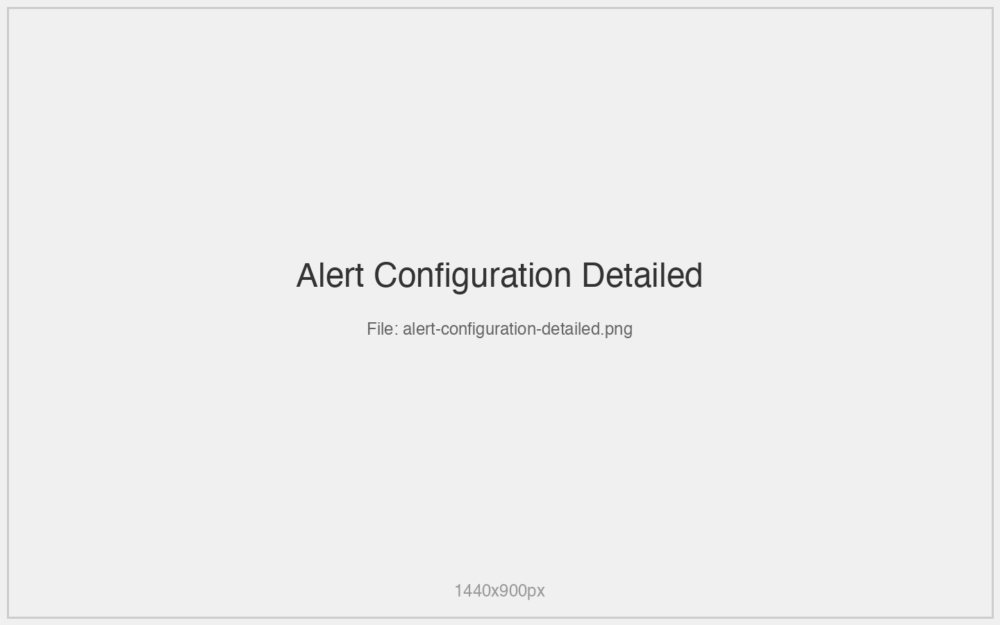
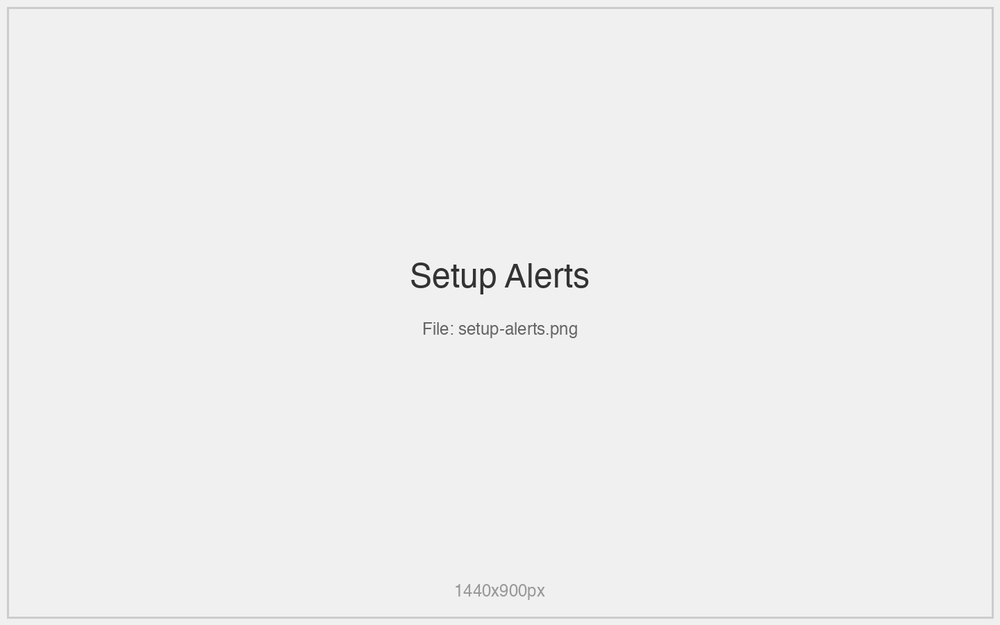
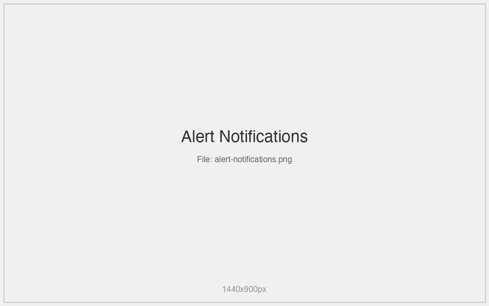

# Monitoring & Metrics

Real-time monitoring and alerting system integrated with AWS CloudWatch.

## CloudWatch Integration

### Metrics Dashboard
- Real-time performance metrics
- Interactive charts using native SwiftUI Charts
- Multiple time ranges (1h, 6h, 24h, 7d)
- Automatic refresh every 60 seconds

### Supported Metrics
- **Capacity Metrics**: Read/Write capacity utilization
- **Performance Metrics**: Latency, throttling events
- **Error Metrics**: User errors, system errors
- **Storage Metrics**: Item count, table size

## Interactive Charts

### Chart Types
- Line charts for trend analysis
- Area charts for cumulative metrics
- Bar charts for discrete events
- Combo charts for correlated metrics

### Chart Features
- Zoom and pan capabilities
- Data point hover information
- Export to image formats
- Time range selection

### Visual Indicators
- Trend arrows with color coding
- Threshold breach highlights
- Performance status badges
- Capacity utilization warnings

## Metric Alerts

### Alert Configuration
- Configurable thresholds for all metrics
- Multiple severity levels (Info, Warning, Critical)
- Custom alert names and descriptions
- Flexible time windows

### Alert Types
- **Threshold Alerts**: Trigger when metric exceeds limit
- **Trend Alerts**: Detect unusual patterns
- **Composite Alerts**: Multiple condition combinations
- **Anomaly Detection**: Machine learning-based alerts

### Notification System
- Native macOS notifications
- Visual alert banners in dashboard
- Alert history and acknowledgment
- Escalation procedures

## Performance Monitoring

### Capacity Tracking
- Read/write capacity utilization
- Auto-scaling recommendations
- Cost optimization suggestions
- Burst capacity monitoring

### Latency Analysis
- Request latency percentiles
- Regional latency comparison
- Operation-type breakdown
- Historical trend analysis

### Error Monitoring
- Error rate tracking
- Error type categorization
- Root cause analysis hints
- Recovery recommendations

## Alert Management

### Alert Dashboard
- Active alerts overview
- Alert severity distribution
- Recent alert history
- Acknowledgment status

### Alert Actions
- Acknowledge alerts
- Snooze notifications
- Edit alert thresholds
- Disable/enable alerts

### Alert History
- Complete alert timeline
- Resolution tracking
- Performance impact correlation
- Trend analysis

## Monitoring Best Practices

### Threshold Setting
- Start with conservative thresholds
- Adjust based on normal usage patterns
- Account for traffic spikes
- Consider business impact

### Alert Fatigue Prevention
- Use appropriate severity levels
- Implement alert suppression
- Group related alerts
- Regular threshold review

### Performance Optimization
- Monitor capacity trends
- Identify bottlenecks early
- Plan for growth
- Optimize query patterns

## Custom Dashboards

### Dashboard Creation
- Drag-and-drop metric selection
- Custom time ranges
- Layout customization
- Save and share dashboards

### Widget Types
- Single metric displays
- Comparison charts
- Status indicators
- Custom calculations

*This is a stub - full documentation will be generated from project source*