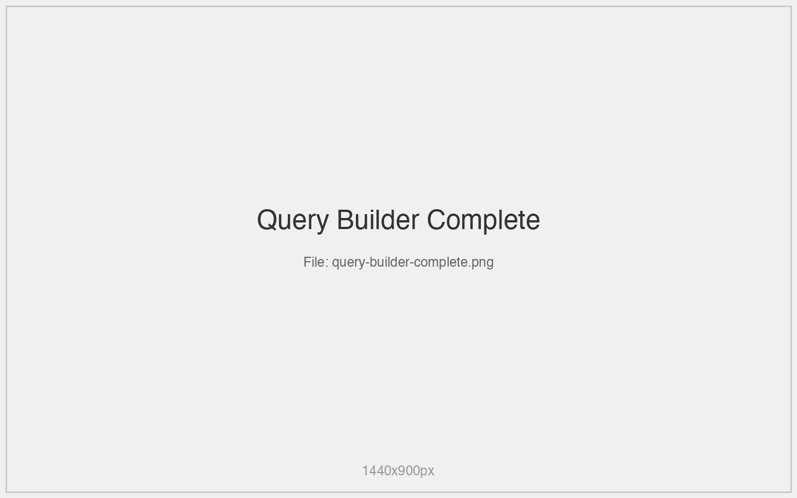
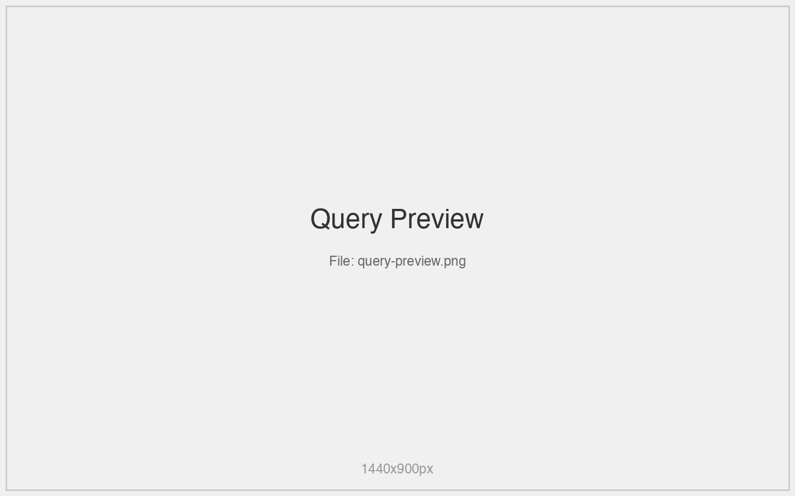
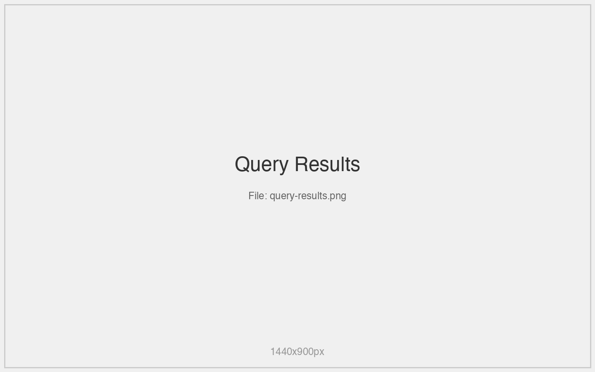
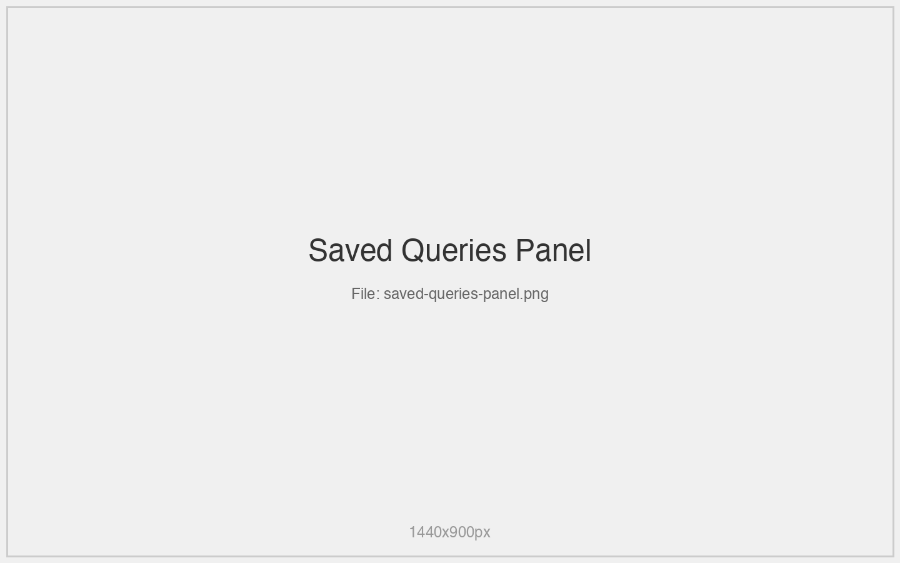

# Query Builder

Visual interface for building complex DynamoDB queries without writing code.

## Overview

The Query Builder provides an intuitive way to construct DynamoDB queries and scans through a visual interface, making it accessible to users who aren't familiar with DynamoDB's query syntax.

## Query Types

### Partition Key Queries
- Simple equality matching
- Required for all queries
- Efficient data retrieval
- Index-aware suggestions

### Sort Key Queries
- Range operations (>, <, >=, <=, between)
- Equality matching
- String prefix matching (begins_with)
- Combined with partition key queries

### Scan Operations
- Full table scans with filtering
- Parallel scan configuration
- Cost and performance warnings
- Progress tracking

## Filter Expressions

### Attribute Conditions
- Equality and inequality operators
- String operations (contains, begins_with)
- Numeric range queries
- Boolean and null checks

### Logical Operators
- AND/OR combinations
- Complex nested conditions
- Parentheses grouping
- Condition precedence

### Function Support
- size() for collection attributes
- attribute_exists() and attribute_not_exists()
- attribute_type() for type checking
- Custom function builder

## Visual Interface

### Drag-and-Drop Builder
- Visual condition blocks
- Connecting operators
- Real-time syntax validation
- Preview of generated expressions

### Attribute Explorer
- Schema-aware attribute suggestions
- Type information display
- Example values
- Index utilization hints

### Query Preview
- Generated DynamoDB expression
- Estimated cost and performance
- Result count predictions
- Execution plan visualization

## Index Selection

### Automatic Index Detection
- Global Secondary Index (GSI) suggestions
- Local Secondary Index (LSI) options
- Cost comparison between indexes
- Performance impact analysis

### Manual Index Override
- Force specific index usage
- Compare execution across indexes
- Index-specific limitations
- Capacity consumption estimates

## Advanced Features

### Projection Expressions
- Select specific attributes
- Reduce data transfer costs
- Nested attribute selection
- Expression validation

### Pagination Control
- Custom page sizes
- Bookmark-based pagination
- Parallel processing options
- Memory usage optimization

### Query Optimization
- Automatic query plan suggestions
- Cost optimization recommendations
- Performance bottleneck identification
- Alternative query strategies

## Saved Queries

### Query Templates
- Save frequently used queries
- Parameterized query templates
- Team sharing capabilities
- Version control for queries

### Query History
- Recently executed queries
- Performance metrics tracking
- Result caching
- Quick re-execution

## Best Practices

### Performance Guidelines
- Prefer queries over scans
- Use appropriate indexes
- Limit result set sizes
- Monitor capacity consumption

### Cost Optimization
- Projection expressions for large items
- Efficient filter conditions
- Batch operations when possible
- Read capacity planning

### Security Considerations
- Attribute-level access control
- Query logging and auditing
- Sensitive data handling
- Rate limiting compliance

*This is a stub - full documentation will be generated from project source*