# Table Operations

Complete guide to working with DynamoDB tables in DinoDB.

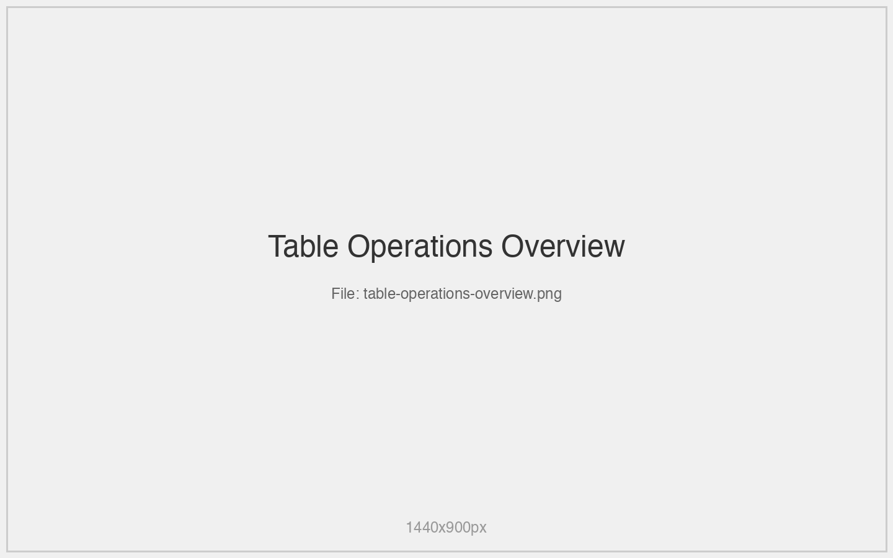

## Table List Views

### Sidebar Mode
- Condensed table list in left sidebar
- Quick table switching
- Search and filter capabilities
- Favorites system

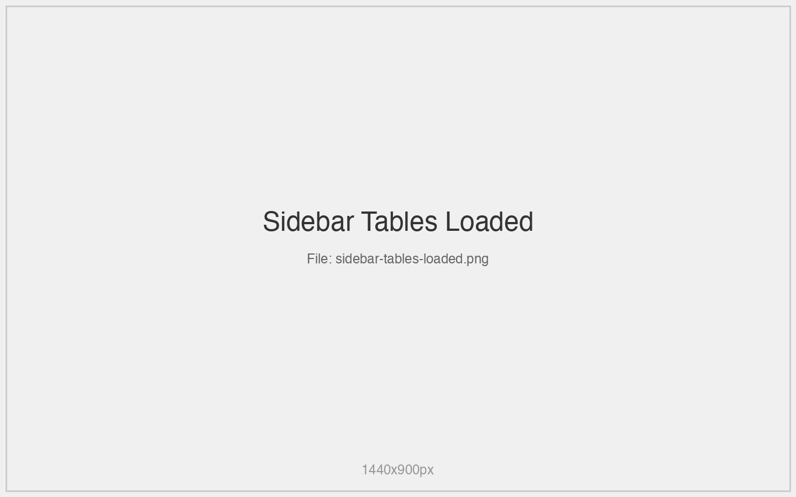

### Full Table View
- Expanded table list with details
- Table metadata preview
- Bulk operations support

## Viewing Table Data

### Display Modes

#### Table View
- Spreadsheet-like interface
- Sortable columns
- Inline editing capabilities
- Row selection and bulk operations

#### JSON View  
- Raw DynamoDB JSON format
- Syntax highlighting
- Copy/paste functionality
- Schema validation

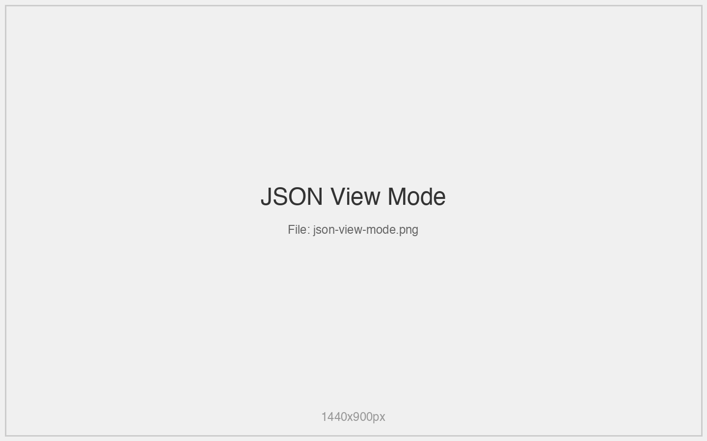

### Pagination Controls
- Configurable page sizes (10, 25, 50, 100, 250)
- Forward/backward navigation
- Jump to specific pages
- Total item count display

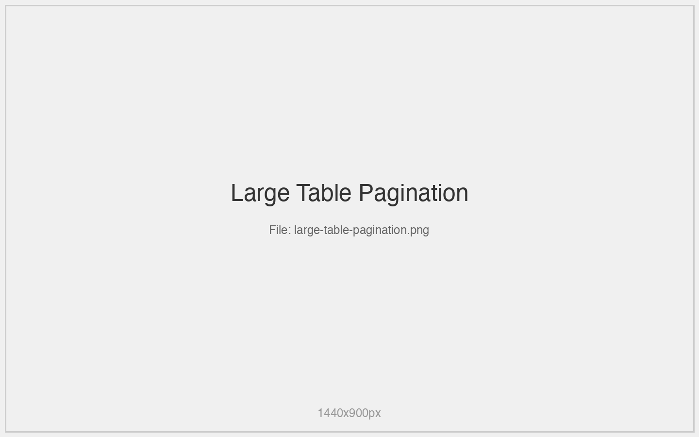

## CRUD Operations

### Creating Items
1. Click **"Add Item"** button

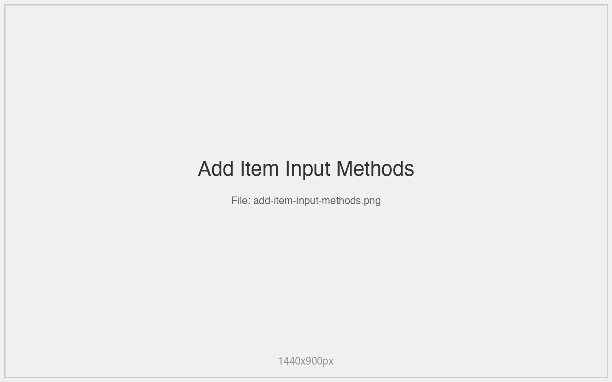

2. Choose input method:
   - Form builder with field validation
   - Direct JSON editor
3. Set attribute types and values
4. Validate and save

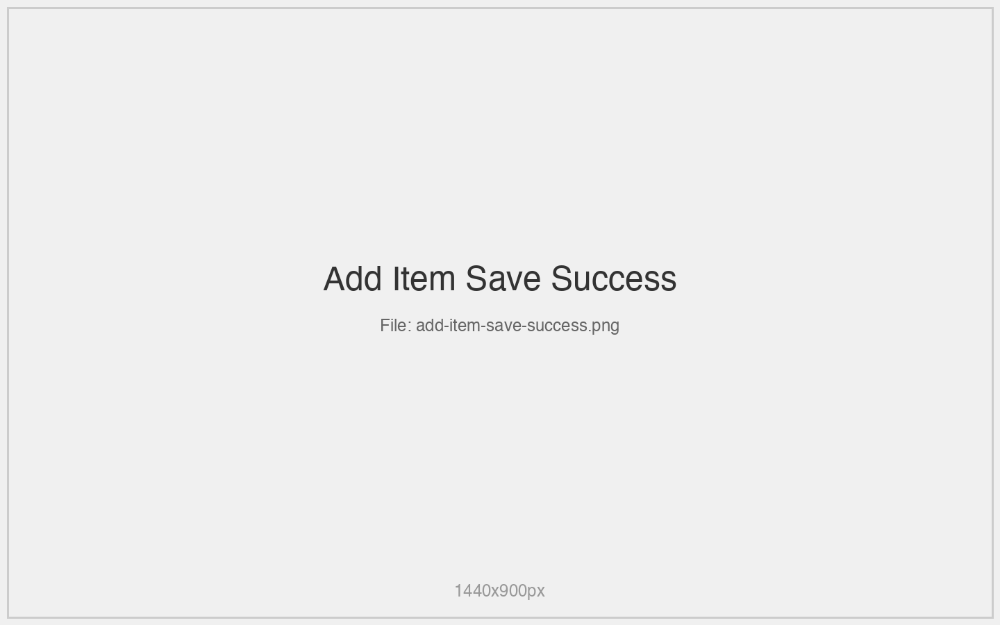

### Reading Items
- Browse with pagination
- Search and filter capabilities
- Export to various formats
- Item detail views with full attribute display

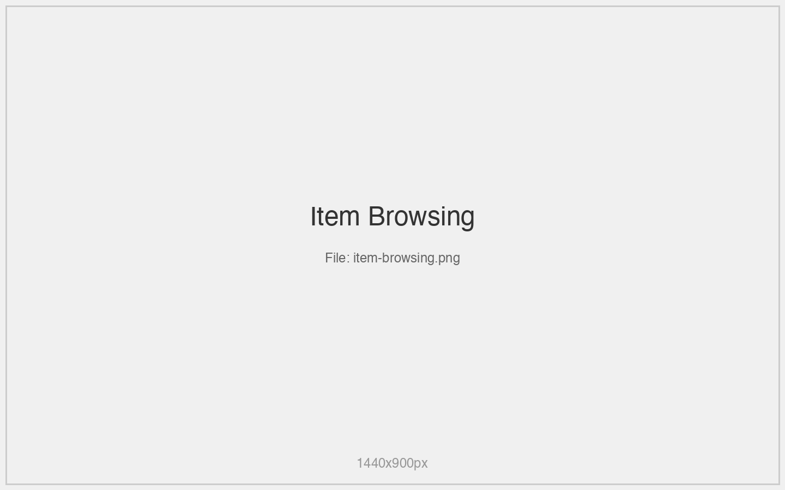

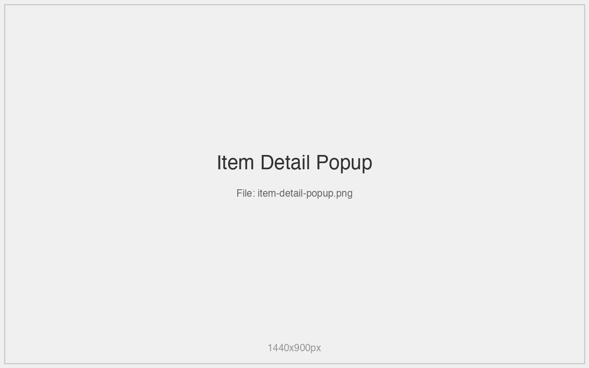

### Updating Items
1. Double-click item to open detail view

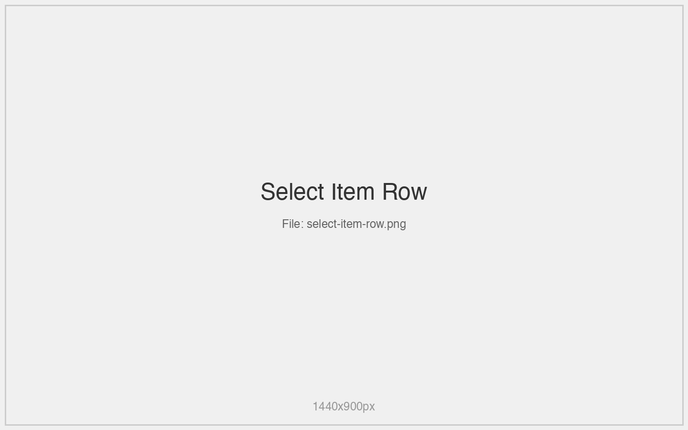

2. Edit attributes in-place
3. Validate changes
4. Save with confirmation

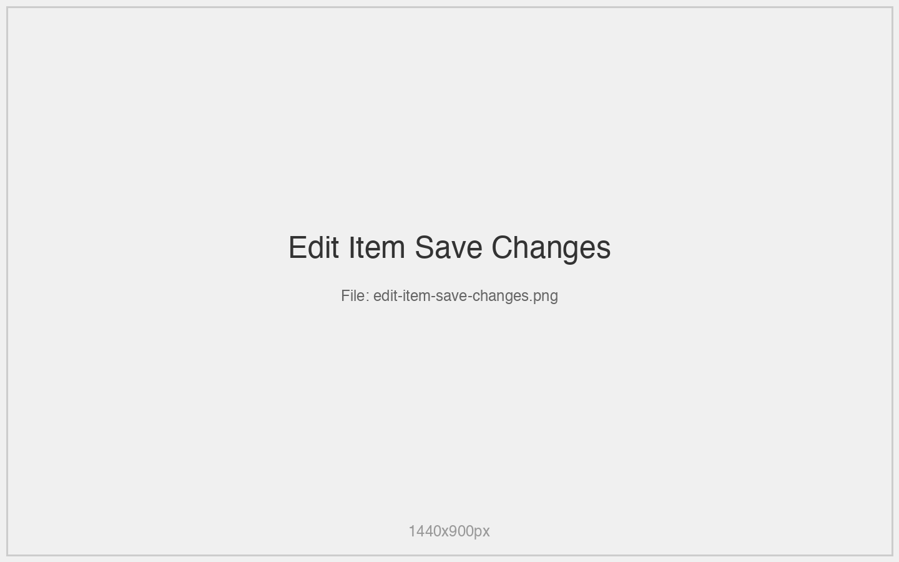

### Deleting Items
- Single item deletion
- Bulk delete operations
- Confirmation dialogs
- Undo capabilities (where supported)

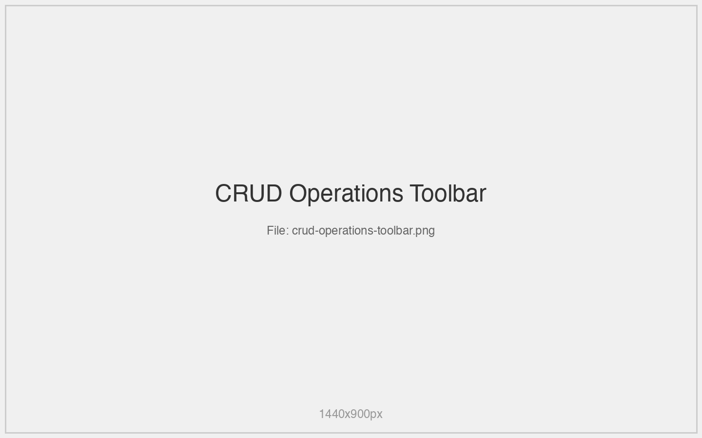

## Query Operations

### Simple Queries
- Partition key filtering
- Sort key range queries
- Attribute-based filtering
- Index utilization

### Advanced Queries
- Complex filter expressions
- Projection expressions
- Conditional operations
- Cross-table queries

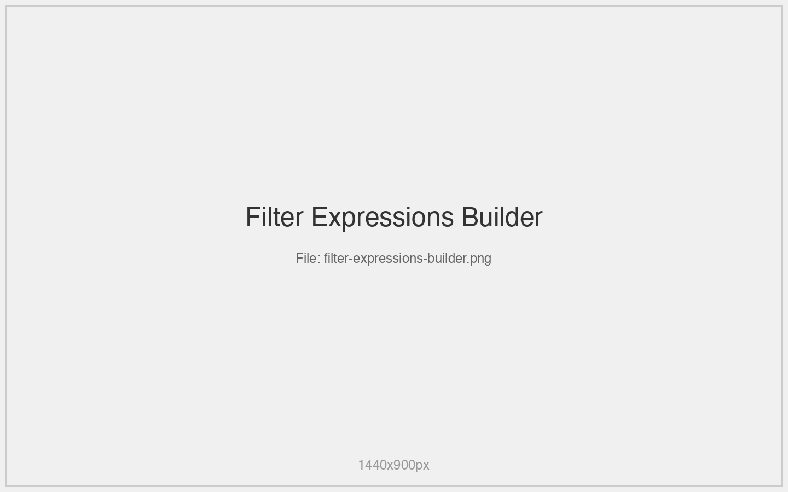

## Table Management

### Table Information
- Schema details and key structure
- Capacity and billing information
- Index configuration
- Stream settings

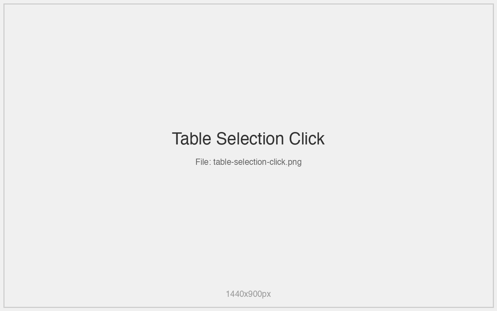

### Table Creation
- Guided table creation wizard
- Schema design assistance
- Capacity planning tools
- Best practice recommendations

### Table Modification
- Index management
- Capacity adjustments
- Stream configuration
- Tag management

## Performance Features

### Optimization Tools
- Query performance analysis
- Scan vs. query recommendations
- Index usage optimization
- Cost estimation

### Monitoring Integration
- Real-time performance metrics
- Capacity utilization tracking
- Error rate monitoring
- Latency analysis

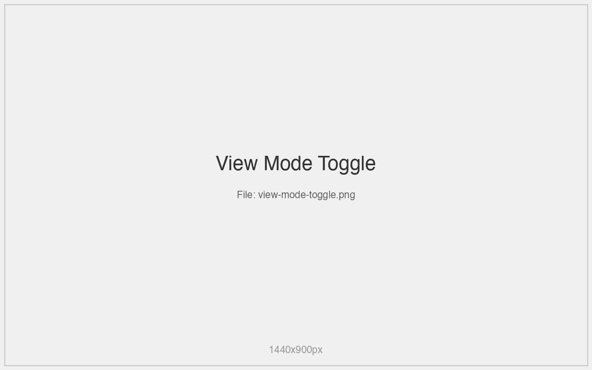

## Data Export/Import

### Export Formats
- JSON
- CSV
- DynamoDB JSON format
- Custom templates

### Import Capabilities
- Bulk data import
- Schema validation
- Error handling and reporting
- Progress tracking

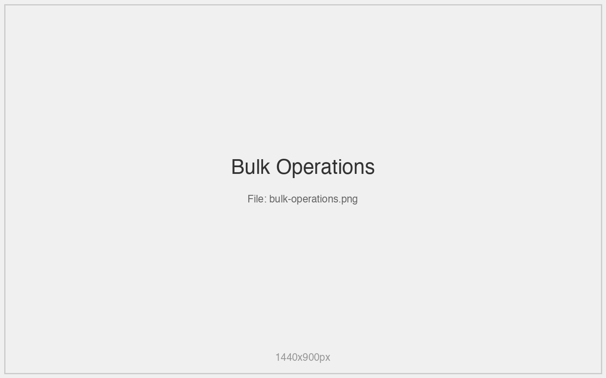

*This is a stub - full documentation will be generated from project source*